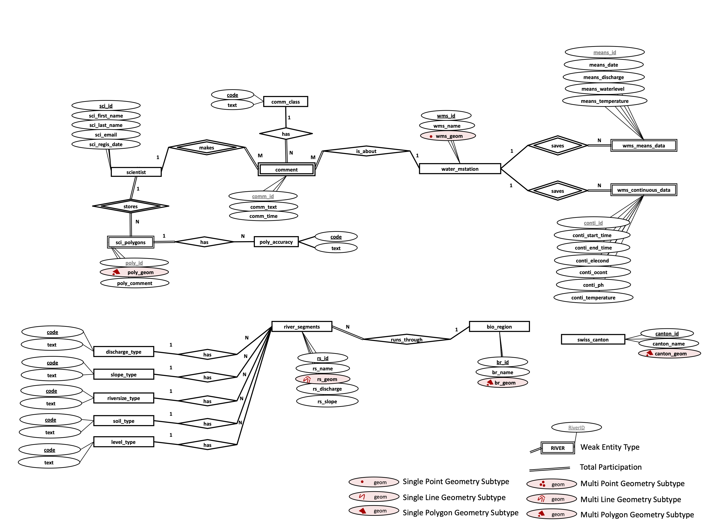

# Swiss-Water-Resources
Spatial Database 

## 1. Analyze Relevant Datasets
- River topology (river size type, level type, discharge type, soil type, slope type)
- Water measurement stations (discharge, waterlevel and temperature) 
- Biogeographical regions

## 2. Conceptual Design
- ER Model 

## 3. Logic Design
- Relational Model

## 4. Physical Design
- Tables
- Datatype

## 5. Loading Data

## 6. Database Information Retrieval
